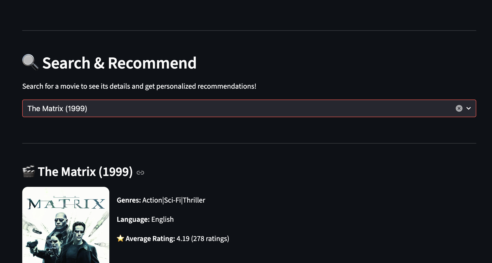
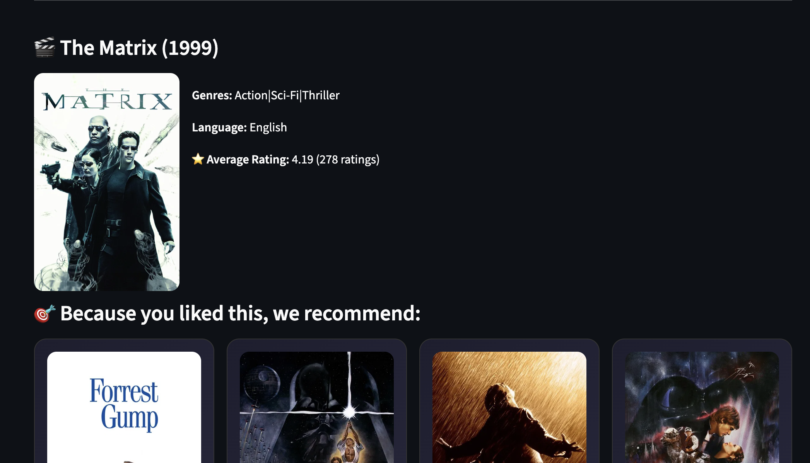
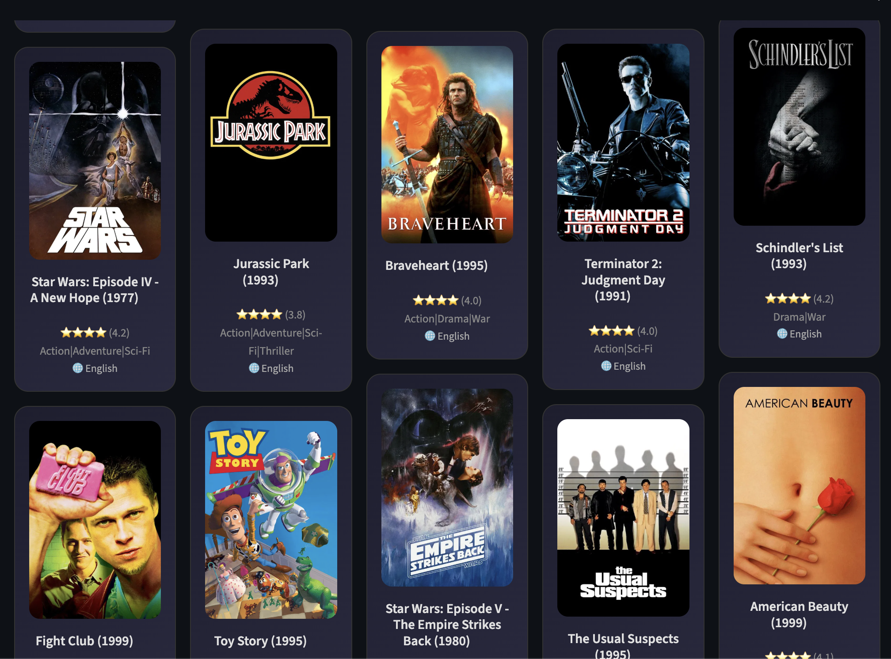
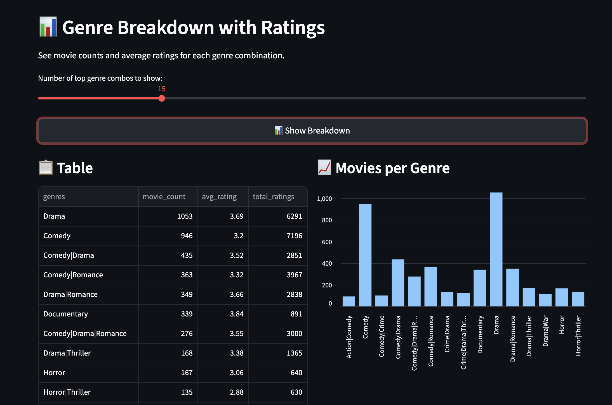
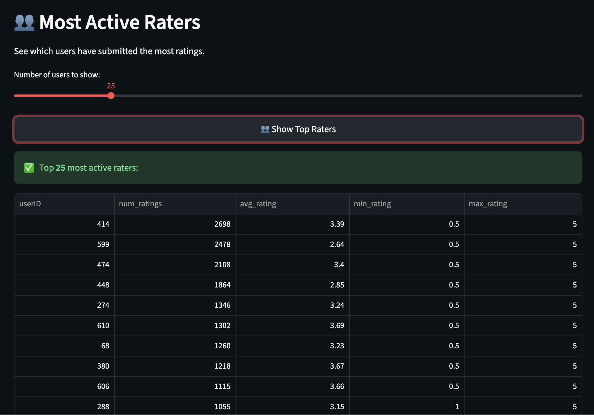

# 🎬 MovieLens Explorer

A high-performance, full-stack movie recommendation and discovery engine powered by **Google BigQuery ML**, **Streamlit**, and the **TMDb API**.

*   **Smart Search & Autocomplete**: Instant title-prefix autocomplete served from an in-memory index of the movie catalog. *(Originally implemented with Elasticsearch — see note below.)*
*   **Personalized Recommendations**: Leverages BigQuery ML Matrix Factorization models to suggest movies based on your historical preferences.
*   **Live Metadata & Posters**: Dynamically fetches high-quality movie posters and original language metadata via the TMDb API.
*   **Genre & Language Filtering**: Advanced multi-genre and language-specific filtering with parallel metadata fetching for smooth UI performance.
*   **Interactive Analytics**: 
    *   **Genre Breakdown**: Visual insights into the most popular genre combinations.
    *   **Top Rated Movies**: Discover the highest-rated classics with customizable rating thresholds.
    *   **Rating Distribution**: Deep dive into global user rating patterns.
    *   **Top Raters**: Identify the most active contributors in the MovieLens community.

## Screenshots

### Search & Recommend
Type-ahead title search with live autocomplete.



### Movie details
Average rating, genres, and original language for the selected title.



### Personalized recommendations
Suggestions generated by the BigQuery ML matrix-factorization model.



### Genre Breakdown analytics
Movie counts and average ratings per genre combination.



### Most Active Raters analytics
The most prolific contributors in the dataset.



## Technical Architecture

*   **Frontend**: Streamlit (Python) for a responsive, dark-themed UI.
*   **Backend**: Flask (Python) handles autocomplete, metadata orchestration, and API communication.
*   **Database**: Google BigQuery for petabyte-scale movie data and ML model execution.
*   **Cloud Hosting**: Containerized with Docker and deployed on **Google Cloud Run**.
*   **Third-Party Integration**: TMDb API for real-time rich media assets.

> **A note on search:** Autocomplete was originally built on **Elasticsearch** (Elastic Cloud), using a `search_as_you_type` index for prefix matching against the movie catalog. It was later simplified to an in-memory index, which is well-suited to the dataset's size (~9.7k titles), removes the dependency on an external search service, and lets the app run end-to-end without a managed search cluster.

## Getting Started

### Configuration

All credentials are supplied via environment variables — nothing secret is committed to the repo. Copy `.env.example` to `.env` and fill in your own values:

```bash
cp .env.example .env
```

| Variable | Description |
| --- | --- |
| `TMDB_API_KEY` | TMDb API key ([get one here](https://www.themoviedb.org/settings/api)) |
| `GOOGLE_CLOUD_PROJECT` | GCP project ID hosting the BigQuery dataset and model |
| `BQ_DATASET` | BigQuery dataset name (default `Movies_Dataset`) |
| `GOOGLE_APPLICATION_CREDENTIALS` | (Local dev only) path to a service account key; Cloud Run uses ADC automatically |
| `BACKEND_PORT` / `BACKEND_URL` | (Optional) Flask backend port and the URL the frontend uses to reach it. Defaults to `5000`; set to `5001` on macOS, where port 5000 is taken by the AirPlay Receiver |

### Running locally

```bash
pip install -r requirements.txt
./entrypoint.sh                 # starts the Flask backend + Streamlit frontend
```

The Streamlit UI is served on port `8080` and the Flask API on port `5000`.

## Data

This project uses the [MovieLens "small" dataset](https://grouplens.org/datasets/movielens/) (`ml-small-*.csv`), provided by GroupLens for educational and research use.


